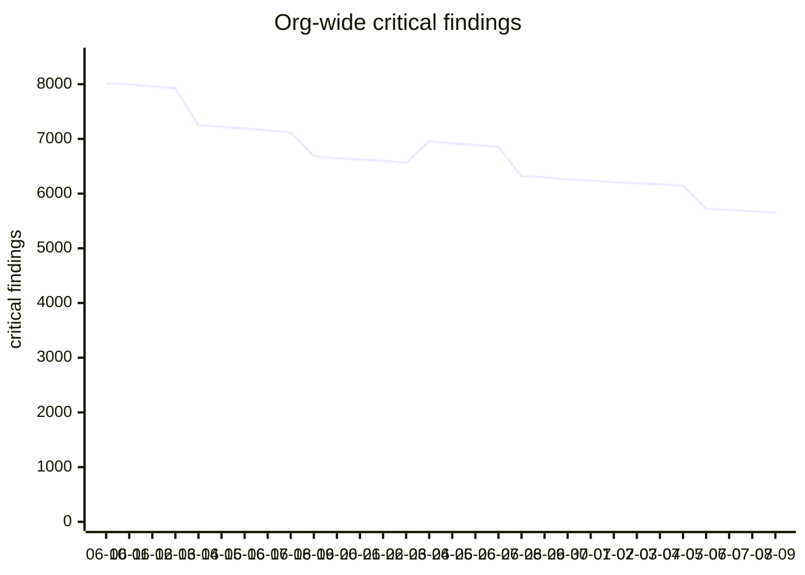

# Remediation fleet board

Shared state for every agent session working the vulnerability backlog.
Human-readable here; machine-atomic claims live in SQLite via `claimboard.py`.

## Ground rules

- **Claim before you touch anything.** `python3 claimboard.py claim --session <you>` takes the next unclaimed task by priority.
- **Commit vault changes the same turn you make them.** Never batch state updates — a batched update is a stale read for every other session.
- **Blocked on a human?** Add it to the box below, release or park the task, and move on.

## Waiting on a human

- [ ] Approve the maintenance window for the ledger-service base-image rebuild
- [ ] Confirm decommission of the 2019-era reporting instances with the finance team

## Burndown

<!-- burndown:begin -->

**5,650** critical findings as of 2026-07-09 (started 8,014 on 2026-06-10, net -2,364).

> [!note] The number went **up** on 2026-06-24 (+393) — browser vendor discloses a new CVE batch — applies to every machine with the browser installed. Disclosures are weather. Only automated refresh keeps you ahead of them.

**Event log:**

- 2026-06-14: decommission wave 1 lands
- 2026-06-19: base-image rebuild cliff
- 2026-06-24: browser vendor discloses a new CVE batch — applies to every machine with the browser installed
- 2026-06-28: dependency pin wave merges
- 2026-07-06: decommission wave 2 lands

<!-- burndown:end -->

## Initiatives

- [[phantom-findings-cleanup]]
- [[base-image-rebuilds]]
- [[decommission-wave]]

## Knowledge

- [[same-turn-commit-rule]]
- [[why-immediate-transactions]]
